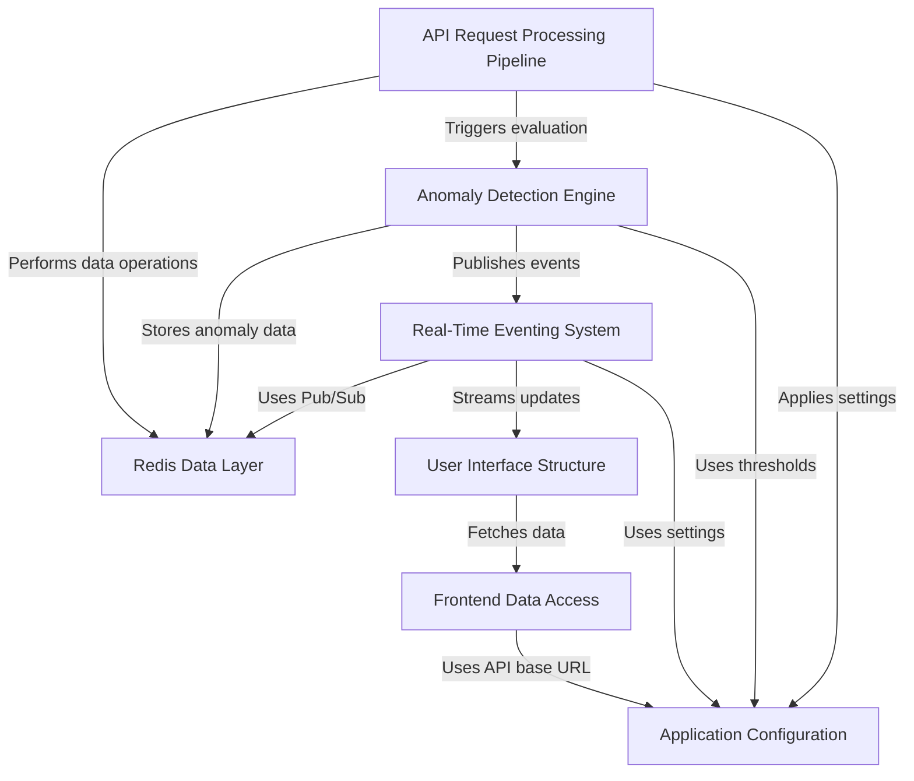

# Real-Time API Traffic Intelligence Engine Logic

## Overview
This project is a real-time API traffic intelligence engine built with:
- Node.js / Express for the server and middleware
- Redis for counters, rate limiting, blocklist, audit logs, and pub/sub
- WebSocket for live event broadcasting
- Clean architecture with controllers, services, middleware, routes, websocket, redis, and config

## Visual Overview

## Request Flow
1. `blocklistMiddleware`
   - early reject if IP is already hard blocked
   - returns `403` before other processing
2. `trafficCaptureMiddleware`
   - records request telemetry in Redis
   - triggers anomaly evaluation asynchronously
3. `softThrottleMiddleware`
   - rejects suspicious IPs currently soft throttled
   - returns `429 throttled_suspicious`
4. `rateLimitSlidingWindow`
   - global rate limiting using Redis Lua sliding window
5. `rateLimitEndpoint`
   - optional endpoint-specific stricter limits
6. Route handlers
   - analytics and admin endpoints

## Traffic Capture and Metrics
- `src/services/trafficService.js`
- Stores per-minute rollups in Redis:
  - `traffic:total:minute:{bucket}`
  - `traffic:topips:minute:{bucket}`
  - `traffic:topendpoints:minute:{bucket}`
  - `traffic:ip:minute:{ip}:{bucket}`
- Builds anomaly window data:
  - `ep:win:{ip}:{endpoint}` for endpoint hammer detection
  - `scan:paths:{ip}` for unique path scan detection

## Rate Limiting
### Global sliding window
- `src/services/rateLimitService.js`
- Uses atomic Redis Lua script:
  - trim old entries
  - add current request timestamp member
  - count entries
  - expire key
- `src/middleware/rateLimitSlidingWindow.js` applies it globally

### Endpoint-specific limits
- `src/middleware/rateLimitEndpoint.js`
- Configurable via `ENDPOINT_RATE_LIMITS`
- Uses the same sliding-window engine per endpoint

## Blocking and Throttling
### Blocklist storage
- `src/services/blocklistService.js`
- Uses Redis:
  - `blocked:ips:set` for O(1) membership lookup
  - `block:ip:{ip}` for TTL-backed block reason

### Block check
- `blocklistMiddleware` checks `isBlocked(ip)`
- If blocked, returns `403 { error: 'blocked', ip }`
- If `block:ip:{ip}` expired, the stale set entry is cleaned up

### Soft throttle
- `softThrottleMiddleware` checks `throttle:ip:{ip}`
- If present, returns `429 { error: 'throttled_suspicious' }`

## Anomaly Detection
- `src/services/anomalyService.js`
- Detects three behaviors:
  - `SPIKE_TRAFFIC` = sudden traffic spike
  - `ENDPOINT_HAMMER` = repeated hits to the same endpoint
  - `SCAN_PATTERN` = many unique paths

### Decision logic
- `SPIKE_TRAFFIC` or `SCAN_PATTERN` => hard block
- `ENDPOINT_HAMMER` => soft throttle
- Hard block stores IP in Redis and records the reason
- Soft throttle stores a throttle flag for a short TTL

## Audit and Real-Time Events
### Audit log
- `src/services/auditService.js`
- Appends flagged events to Redis stream `flags:stream`
- Supports reading recent flag events and filtering by IP

### Event bus
- `src/services/eventBus.js`
- Publishes JSON events to `traffic:intelligence`

### WebSocket hub
- `src/websocket/hub.js`
- Authenticates clients using `wsToken`
- Subscribes to Redis pub/sub and broadcasts events to clients

## API Endpoints
- `GET /api/v1/health` — health check
- `GET /api/v1/analytics/overview` — dashboard rollups and blocked sample
- `GET /api/v1/analytics/flags` — recent flag events
- `GET /api/v1/analytics/ip/:ip` — per-IP history and flags
- `POST /api/v1/admin/unblock` — unblock IP with admin API key

## Startup and Config
- `src/server.js` initializes the Express app, Redis, Lua script, WebSocket hub, and baseline updater
- `src/config/index.js` loads env vars and defines defaults

## Key design points
- Blocklist is fast and scalable using Redis SET membership plus TTL string validation
- Sliding window rate limiting is atomic via Redis Lua
- Audit stream preserves immutable flag records
- Pub/Sub + WebSocket enable real-time UI updates
- Middleware ordering preserves performance and security

## How to trigger blocked IPs
- The engine throttles repeated identical endpoints first
- To trigger a hard block, use unique paths quickly to hit `SCAN_PATTERN`
- Example: call `/demo/1`, `/demo/2`, ..., `/demo/45`
